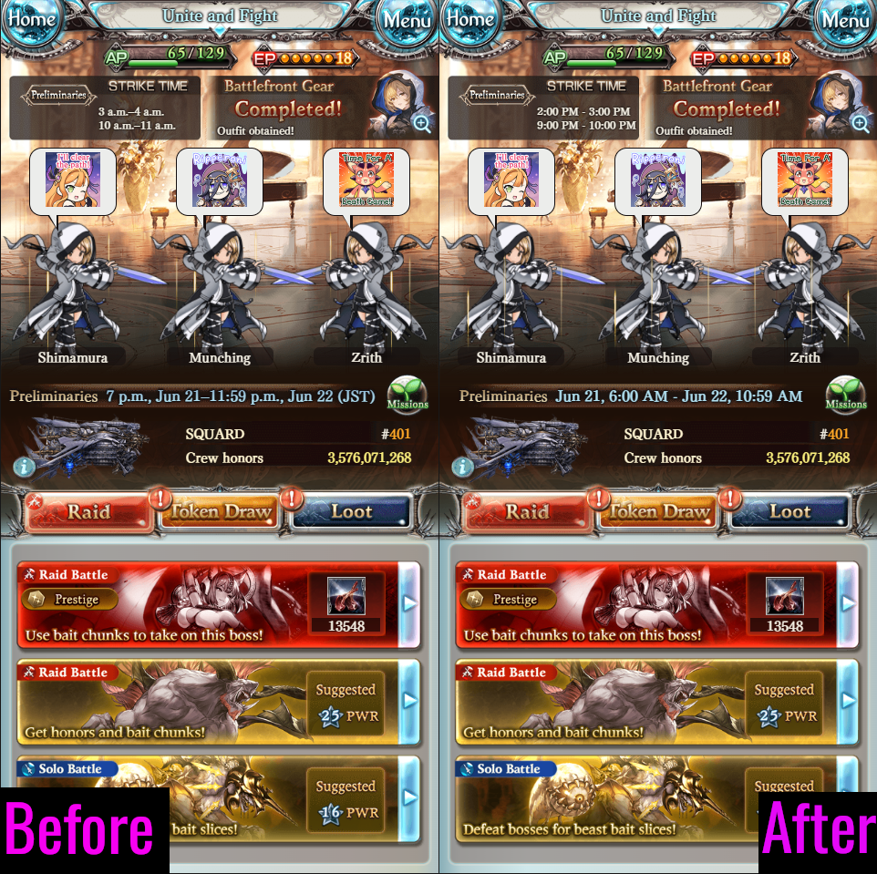

# GBF Time Translator
Bookmarklet that changes all times on a GBF screen to local time. Does not work on all pages right now; support for more pages will be added over time so check back later.

## Installation
Copy [this](https://raw.githubusercontent.com/cajunwildcat/GBF-Time-Translator/main/bookmarklet) code and paste it into the URL bar of a new bookmark in the browser you use to play GBF.

## Examples
